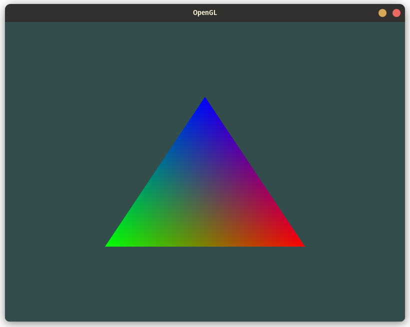
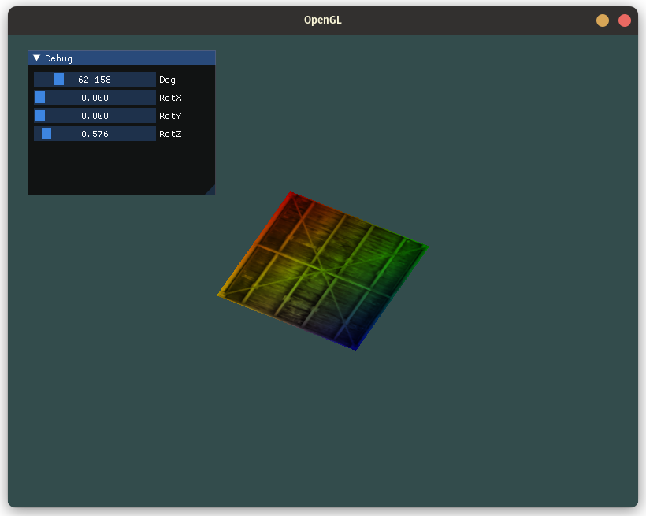

# OpenGL Renderer

## Idea
- Modern C++ OpenGL Renderer
## Version

- [0.1.0] Hello Window
- [0.2.0] Hello Triangle
- [0.2.1] Shader header
- [0.2.2] Texture Loading and Transform
- [0.2.3] ImGUI

## Screenshots

### Hello triangle

### Texture and Transform

### imGUI

