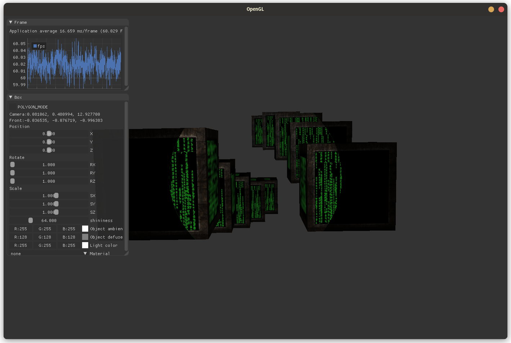

# OpenGL Renderer

## Idea
- Modern C++ OpenGL Renderer

# TODO

- [x] Windows and basic rendering
- [x] Lighting
  - [x] Color
  - [x] Basic lighting
  - [x] Material
  - [x] Lighting Maps
  - [x] Light casters
  - [x] Multiple lights
- [x] Model Loading
    
## Version

- [0.1.0] Hello Window
- [0.2.0] Hello Triangle
- [0.2.1] Shader header
- [0.2.2] Texture Loading and Transform
- [0.2.3] ImGUI
- [0.2.4] Perspective projection
- [0.2.5] Camera and keyboard & mouse input - Imgui intergrated
- [0.2.6] Implot
- [0.3.0] Basic Lighting and Color
- [0.3.1] Diffuse, Specular, and Phong lighting
- [0.3.2] Materials
- [0.3.3] Lighting Maps
- [0.3.4] Light casters and Multiple Lights
- [0.4.0] Model Loader
- [0.4.1] Add Sphere, clean source code
- [0.5.0] Lighting System w Lighting setup pre-drawing 3D object;

## Screenshots

### Model loader

### Multiple Lights

### Light casters

#### Point light

#### Spot light

#### Spot light with soft edges

### Ligting maps

### Materials

#### Defuse Lighting

### Implot

### Movements

### ImGUI

### Texture and Transform

### Hello triangle

